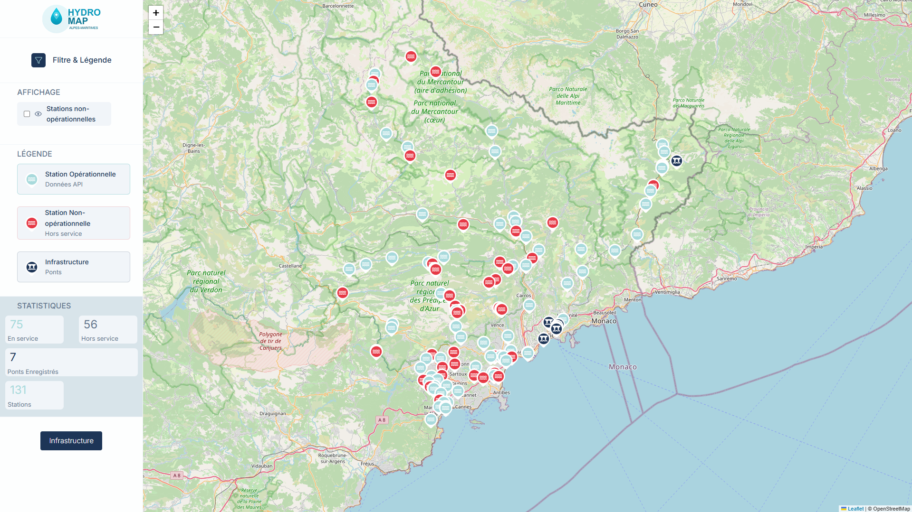
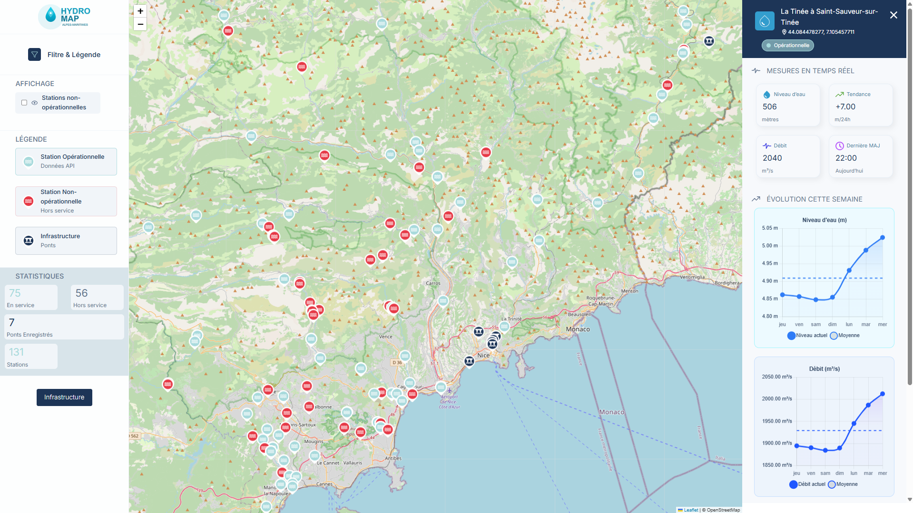
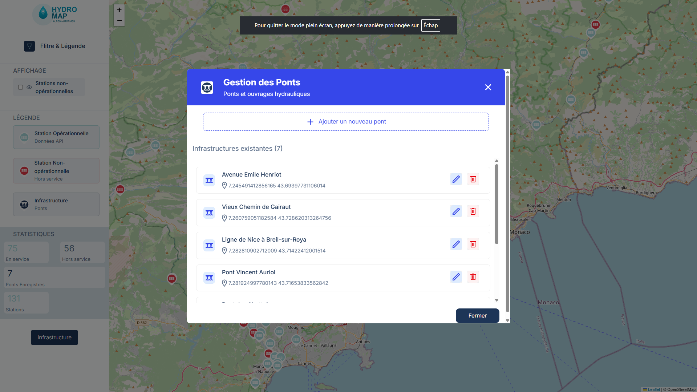

# Full Stack Hydrometry & Bridges

Application full-stack permettant de visualiser les stations hydrométriques (Hubeau API) et les infrastructures (ponts) via une carte interactive, un panneau latéral et des widgets de graphes.

## Aperçu du Design

Placez ici une image du design global .

## Outils & technologies

- Frontend:
  - Angular 21, Vite (dev server & build)
  - Leaflet (cartographie), Chart.js (graphes)
  - TypeScript, SCSS
  - Vitest (tests unitaires), ESLint (lint), Prettier (formatage)
  - VS Code: tasks.json, launch.json (débogage)
- Backend:
  - Django, Django REST Framework
  - PostgreSQL + PostGIS (données géospatiales)
  - Docker (conteneurs), manage.py (outils CLI)
- Intégrations:
  - Hubeau API (hydrométrie)
  - Axios côté front pour les appels HTTP
- Maquette :
  - Figma
  

## Structure du projet

- frontend/
  - src/app/components/map: carte Leaflet, markers stations/ponts, interactions.
  - src/app/components/sidebar: filtre stations (opérationnelles), légende, toggles.
  - src/app/components/sliderbarData/components/widget: widget de graphes (observations récentes).
  - src/app/services/hydrometry: appel Hubeau, normalisation des observations.
  - src/app/services/infrastructure: appel backend ponts.
  - src/app/models: Observation, Station, Infrastructure.
  - app.routes.ts: routes simples (carte, sidebar).
- backend/
  - app/: config Django.
  - bridges/: app Django (models, serializers, views, urls, tests).
  - endpoints DRF:
    - GET /bridges: liste des ponts
    - GET /bridges/:id: détail
    - POST /bridges: création
    - PUT/PATCH /bridges/:id: mise à jour
    - DELETE /bridges/:id: suppression

## Fonctionnalités clés

- Carte:
  - Affiche stations hydrométriques (région 06) depuis Hubeau.
  - Distinction visuelle stations opérationnelles/non-opérationnelles.
  - Affiche ponts depuis backend (icônes distinctes).
  - Clic sur marker: infos dans la sidebar.
- Sidebar:
  - Filtres (afficher/masquer non-opérationnelles, période).
  - Légende et toggles.
- Widget:
  - Graphique des observations (niveaux d’eau) sur la semaine en cours.
  - Se met à jour au changement de station sélectionnée.

## Points de code importants

- MapComponent (src/app/components/map/map.ts)
  - Initialise Leaflet, charge stations Hubeau et ponts backend, place les markers.
  - Gère les clics et communique avec la Sidebar.
- SidebarComponent (src/app/components/sidebar/sidebar.ts)
  - Émet des événements de filtre (showStations/showBridges, période).
- HydrometryService (src/app/services/hydrometry/hydrometry.service.ts)
  - Appelle Hubeau pour observations d’une station, expose getObservations/getLatest.
- InfrastructureService (src/app/services/infrastructure/infrastructure.service.ts)
  - Liste/lecture des ponts via API Django.
- bridges app (backend/bridges/)
  - models.py: modèle Bridge (géométrie, attributs).
  - serializers.py: sérialise le modèle pour DRF.
  - views.py: ViewSets CRUD.
  - urls.py: routage des endpoints.

